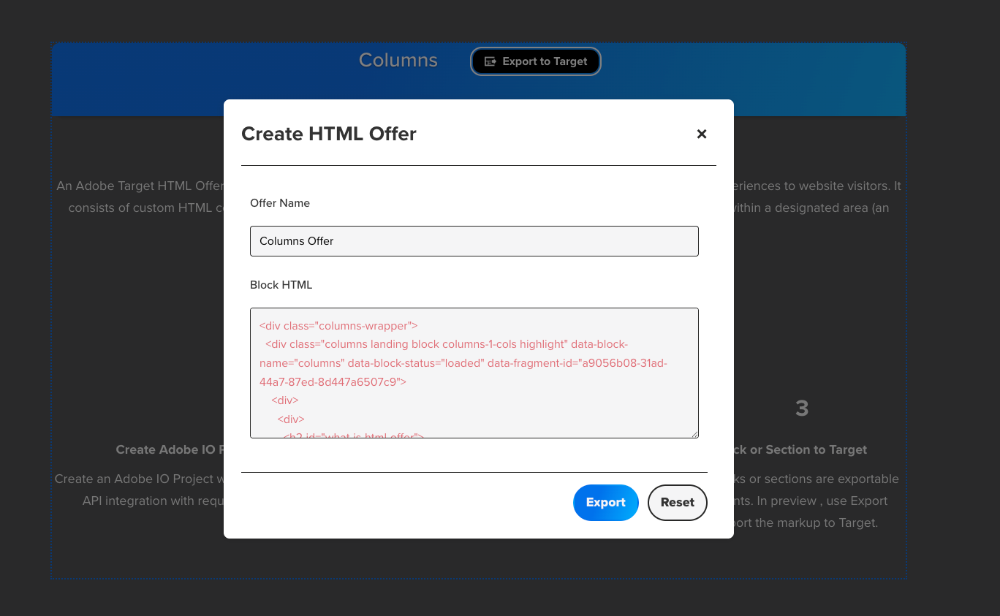

# Adobe Target HTML Offer Integration

Export any block or section from your EDS project as an HTML Offer directly to Adobe Target for A/B testing and personalization campaigns.

## Quick Start

**What this does**: Content authors can export any block/section to Adobe Target with one click, enabling quick A/B testing without developer involvement.

**Get up and running**:
1. [Create Adobe IO Project w/ Adobe Target API](#step-1-create-adobe-io-project-w-adobe-target-api)
2. [Create and Deploy Adobe IO Actions](#step-2-create-and-deploy-adobe-io-actions)
3. [Test Integration](#step-3-test-integration)
4. [Create Sidekick Plugin for Unique ID Generation](#step-4-create-sidekick-plugin-for-unique-id-generation)

## Developer Setup

**Note**: For detailed Adobe I/O Runtime setup instructions, see the [Adobe I/O Runtime Getting Started Guide](https://developer.adobe.com/runtime/docs/guides/getting-started/).

### Step 1: Create Adobe IO Project w/ Adobe Target API
Follow the [official Adobe Target API authentication guide](https://experienceleague.adobe.com/en/docs/target-dev/developer/api/configure-authentication) to:
- Create a project in Adobe Developer Console
- Add Adobe Target API
- Generate JWT credentials
- Note your **Client ID** and **Client Secret**

### Step 2: Create and Deploy Adobe IO Actions
```bash
cd aio
aio app deploy
```

**Need details?** → [Adobe I/O Runtime Getting Started Guide](https://developer.adobe.com/runtime/docs/guides/getting-started/)

### Step 3: Test Integration
```bash
aio runtime action invoke sling-da/gettoken
```

**Need details?** → [gettoken action](aio/actions/gettoken/index.js)

### Step 4: Create Sidekick Plugin for Unique ID Generation
Create a Sidekick plugin that allows authors to generate unique IDs for blocks and sections. This plugin should:
- Generate UUIDs for blocks when authors specify them as exportable
- Add the unique ID to the block's metadata/properties
- Handle the markup generation with `data-id` attributes
- Integrate with the export functionality

**Need details?** → [Sidekick Plugin Implementation](#sidekick-plugin-implementation)

## Content Author Flow

### Step 1: Specify Blocks and Sections that can be exported
Authors can add a unique id to Block as a variant and a property section metadata.


### Step 2: Export to Target
1. Open your page in Sidekick
2. Blocks with unique IDs will show an "Export to Target" button
3. Click button → Fill form → Export to Adobe Target




**Note**: If you see a warning message about logging into Sidekick, please log in and refresh the page before exporting offers.


**Need details?** → [Using HTML Offers in VEC Editor](#using-html-offers-in-vec-editor)

## Detailed Documentation

### Environment Configuration

#### Required Environment Variables
See the actual configuration in [app.config.yaml](aio/app.config.yaml) for the complete setup.


#### Dependencies
See the actual dependencies in [package.json](aio/package.json).

#### Configuration File
See the complete configuration in [app.config.yaml](aio/app.config.yaml).

### Testing Your Integration

#### Test Authentication
See the main function in [gettoken action](aio/actions/gettoken/index.js) around lines 10-50 and the main function in [exportoffers action](aio/actions/exportoffers/index.js) around lines 20-60.

#### Verify Deployment
Use the Adobe IO CLI commands to verify your deployment is working correctly.


### Export Dialog

#### HTML Structure
See the complete HTML structure in [htmloffer.html](tools/htmloffer/htmloffer.html).

#### JavaScript Logic
See the form submission handler and export logic in [htmloffer.js](tools/htmloffer/htmloffer.js) around lines 50-80.

### Content Highlighting

#### CSS for Exportable Blocks
See the CSS styling in [htmloffer.css](tools/htmloffer/htmloffer.css).

#### JavaScript Highlighting
See the `showBlocks` function and export button creation in [utils.js](eds/scripts/utils.js) around lines 900-950.

### Event Rebinding System

#### Automatic Event Rebinding
See the `setupBlockObserver` function in [scripts.js](eds/scripts/scripts.js) around lines 780-800.

#### Example: Carousel Rebinding
See the `rebindEvents` function in [carousel.js](eds/blocks/carousel/carousel.js) around lines 50-80.


## Sidekick Plugin Implementation

### Overview
The Sidekick plugin provides authors with a user-friendly interface to generate unique IDs for blocks and sections that can be exported to Adobe Target.

### Implementation Details
The plugin integrates with the existing `tools/htmloffer/` functionality and extends the Sidekick interface to:
- Generate UUIDs for exportable blocks
- Store unique IDs in block metadata/properties
- Handle markup generation with `data-id` attributes
- Integrate with the export functionality

### Code Structure
See the actual implementation in:
- [properties.js](tools/properties/properties.js) - UUID generation around lines 25-35
- [utils.js](eds/scripts/utils.js) - Fragment ID processing (lines 1010-1020) and export button creation (lines 900-950)

### Integration Points
- **Properties Tool**: Extends existing `tools/properties/` functionality
- **HTML Offer Tool**: Integrates with `tools/htmloffer/` for export workflow
- **Sidekick**: Provides UI components for author interaction

## Using HTML Offers in VEC Editor

### Step 1: Access Adobe Target
1. Log into Adobe Experience Cloud
2. Navigate to Adobe Target
3. Go to **Offers** > **Code Offers**

### Step 2: Locate Your HTML Offers
1. Your exported offers will appear in the **Code Offers** section
2. Offers are named according to what you specified during export
3. Each offer contains the HTML content from your blocks/sections

### Step 3: Use in VEC Editor
1. **Create Activity**: Go to **Activities** > **Create Activity**
2. **Choose Activity Type**: Select your desired activity type (A/B Test, Experience Targeting, etc.)
3. **Enter URL**: Specify the page where you want to test
4. **Open VEC Editor**: Click **Next** to open the Visual Experience Composer
5. **Apply HTML Offer**:
   - Click on the element you want to replace
   - Choose **Replace Content** action
   - Select **HTML Offer**
   - Choose your exported HTML offer
6. **Save and Test**: Save your activity and start testing

### Step 4: Targeting and Scheduling
1. **Audience Targeting**: Define who should see the offer
2. **Goals and Metrics**: Set up conversion tracking
3. **Schedule**: Set start and end dates
4. **Activate**: Launch your activity

## Troubleshooting

### Common Issues

#### 1. Authentication Errors
**Problem**: "Failed to obtain access token"

**Solutions**:
- Verify `ADOBE_CLIENT_ID` and `ADOBE_CLIENT_SECRET` are correct
- Check JWT scopes are properly configured
- Ensure service account has proper Target permissions

#### 2. Runtime Errors
**Problem**: "Action not found" or deployment failures

**Solutions**:
- Verify namespace exists: `aio runtime namespace list`
- Check action deployment: `aio runtime action list`
- Ensure environment variables are set: `aio app config get`

#### 3. Target API Errors
**Problem**: "Failed to create/update offer"

**Solutions**:
- Verify Target tenant ID is correct
- Check workspace ID exists and is accessible
- Ensure service account has proper Target permissions


### Debug Commands
```bash
# Check action status
aio runtime action list
aio runtime action get sling-da/gettoken
aio runtime action get sling-da/exportoffers

# View logs
aio runtime activation list
aio runtime activation logs activation_id

# Test actions manually
aio runtime action invoke sling-da/gettoken
```

### Environment Variable Checklist
```bash
# Required variables
ADOBE_CLIENT_ID=your_client_id
ADOBE_CLIENT_SECRET=your_client_secret
ADOBE_TARGET_SCOPES=openid,AdobeID,target_sdk,target_admin,target_write,target_read,additional_info.projectedProductContext,read_organizations,additional_info.roles
AIO_RUNTIME_NAMESPACE=your_runtime_namespace
ADOBE_TARGET_TENANT=your_tenant_id
ADOBE_TARGET_WORKSPACE_ID=your_workspace_id
```

## References

### Official Documentation
- [Adobe Target Developer Guide](https://experienceleague.adobe.com/en/docs/target-dev/developer/api/configure-authentication)
- [Adobe I/O Runtime Getting Started Guide](https://developer.adobe.com/runtime/docs/guides/getting-started/)
- [Adobe IO Console](https://console.adobe.io/)
- [Adobe IO CLI](https://github.com/adobe/aio-cli)
- [Adobe Target API Reference](https://developer.adobe.com/target/apis/)
